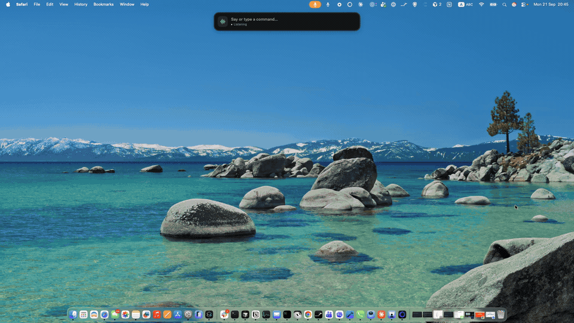

# Jev Voice

### Talk to your Mac. Watch it work.

A small floating bar for voice and text commands. Jev picks the next action from your Mac’s live controls, the app executes it, and the loop continues toward your request.

[](https://github.com/ronadin2002/jev-cua/actions/workflows/macos.yml)

[](https://typesafe.ai/blog/introducing-system-one-models-and-jev)

[](https://github.com/ronadin2002/jev-cua/raw/refs/heads/main/assets/demo.mp4)

**[Download the full demo · 42 seconds, with sound (MP4) →](https://github.com/ronadin2002/jev-cua/raw/refs/heads/main/assets/demo.mp4)**

Preview above plays at 2× speed. The downloadable video plays at its original speed.

**[Get started](#get-started)** · **[How it works](#how-it-works)** · **[Contribute](CONTRIBUTING.md)**

## One bar, wherever you work

- **Keep talking.** Turn the mic on once. Speak a full request, pause, then give another. Commands queue while work is in progress.
- **Type when you prefer.** Click the bar, enter a command, and press Return. Text commands work with the mic off.
- **Complete multiple steps.** Each action is followed by a fresh observation and another Jev decision. Options come from the current interface and installed apps.
- **See what is happening.** The bar shows your command and current action. Settings → Jev activity shows the model’s inputs, choices, errors, and observed results.

The bar stays available across apps and full-screen Spaces. There is no confirmation queue; the stop button and “cancel task” interrupt execution.

## In the demo

| Spoken request | Visible action |
| --- | --- |
| “Open Chrome” | Launches the browser. |
| “Search for restaurant” | Enters a query and opens Google results. |
| “Open Calculator,” then “What’s 90 + 7?” | Uses Calculator’s controls to produce **97**. |
| “Open Photo Booth,” then “Take a photo of me” | Opens the camera app and triggers the shutter countdown. |

This is a recording of the app in use. It demonstrates these interactions; it is not a performance benchmark or a guarantee for every app.

## Get started

You need **an Apple silicon Mac with macOS 14+**, Xcode command-line tools, and **your own funded OpenRouter or TypeSafe API key**. An OpenRouter key (`sk-or-…`) uses `~typesafe/jev-latest` through OpenRouter; a TypeSafe key (`apikey_…`) calls `jev-latest` directly at `api.typesafe.ai`. No generative planner is involved.

### 1. Build and open

```sh
# Install the Apple command-line tools if needed:
xcode-select --install

# Clone and build:
git clone https://github.com/ronadin2002/jev-cua.git
cd jev-cua
bash build.sh
open 'dist/Jev Voice.app'
```

The app is built into `dist/`. The source currently builds with Swift 6.2.3 in Swift 5 language mode. No package manager or third-party Swift dependencies are required.

### 2. Connect and grant permissions

In **Settings → General**, enter your OpenRouter or TypeSafe key. The provider is chosen from the key prefix. It is saved in **macOS Keychain**.

Enable **Accessibility** to let the app operate your Mac. Enable **Microphone** and **Speech Recognition** for voice input. These permissions are managed in **System Settings → Privacy & Security**. After setup, the bar is available for commands and normal launches start listening automatically.

The build uses an available Developer ID Application identity, with an ad-hoc fallback. Keep the app path and signing identity stable between builds so macOS can retain permissions. Set `JEV_SIGNING_IDENTITY` to choose an identity (`-` means ad-hoc); `JEV_OUTPUT_DIR` changes the build destination.

### 3. Speak or type

Start with “Open Calculator and calculate 6 plus 7,” or focus an editable field and say `Type "hello from Jev"`. These are example requests, not built-in task recipes.

| Control | What it does |
| --- | --- |
| Microphone button / **Option–Space** | Toggle continuous listening. |
| **Return** in the bar | Send a typed command. |
| “End command” | Finish an utterance explicitly. |
| “Cancel task” / stop button | Stop the current task and clear queued commands. |
| “Stop listening” | Turn off the mic while an active task can continue. |
| Menu-bar icon → **Settings & diagnostics** | Connection, permissions, and Jev activity. |

Recognition currently uses English. For literal typing, quote the text you want inserted.

## How it works

```text
Your voice or text command
           ↓
Observe the current Mac interface
           ↓
Jev selects an available action
           ↓
Execute → observe again → repeat
           ↓
Check the result against the request
```

Jev is the option picker. Swift discovers controls and executes the selected action through macOS Accessibility, keyboard, and pointer APIs. The original request stays in context throughout the loop.

Large action lists are grouped so every discovered action stays reachable without asking about every group. Typing selects literal text from the request or observed screen text. There are no hardcoded website shortcuts or per-app task scripts.

[Read the decision-loop architecture →](docs/architecture.md)

## Current limits and privacy

This is an experimental Accessibility-based controller. Apps with missing or stale Accessibility information can fail. Jev does not understand screenshots or generate original prose, and completion checks can be wrong. Unquoted typing requests can be less reliable than explicit quoted text.

Speech is transcribed on-device. **Commands, relevant screen text, and action options go to OpenRouter or TypeSafe** (depending on your key) for Jev decisions. API keys stay in Keychain and process memory. Secure text fields are excluded.

Local diagnostics can contain private screen text and URLs. Credentials and authorization headers are excluded from those traces. Only the intentionally published demo media lives in this repository; local recordings, keys, diagnostic traces, and app builds are ignored.

## Build checks and contributing

```sh
'dist/Jev Voice.app/Contents/MacOS/JevVoice' --self-test
'dist/Jev Voice.app/Contents/MacOS/JevVoice' --activity-test
```

These checks run without API keys or paid calls. GitHub Actions runs the same build and local suites on macOS; its badge reflects those checks, not live model accuracy.

[Testing and diagnostics](docs/testing.md) · [Contribution guide](CONTRIBUTING.md) · [Report a reproducible issue](https://github.com/ronadin2002/jev-cua/issues)

If this is a project you want to follow, **star the repository**. Reproducible task failures and improvements to UI discovery are especially useful contributions.
